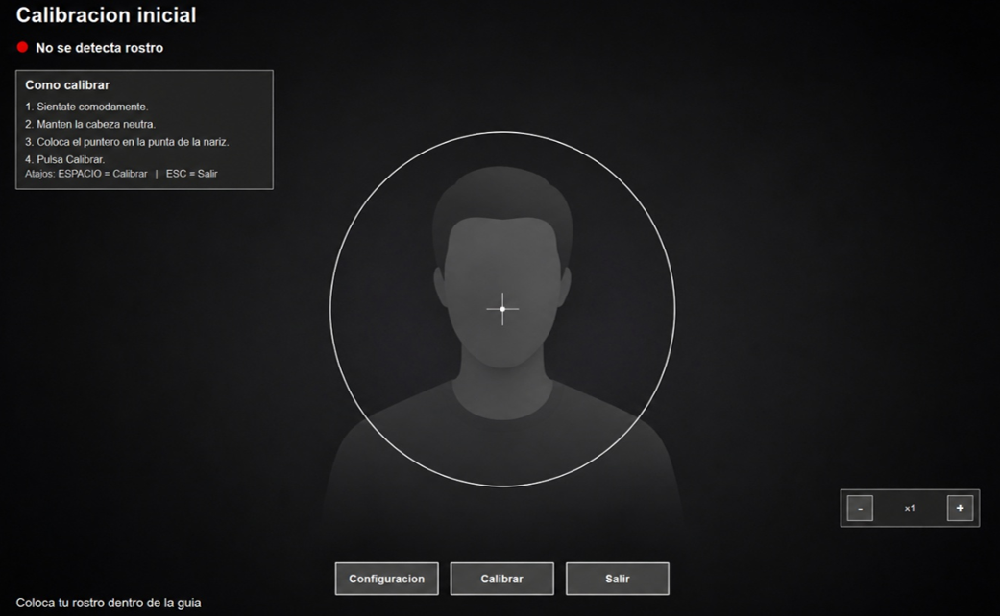
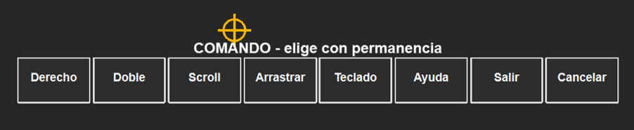
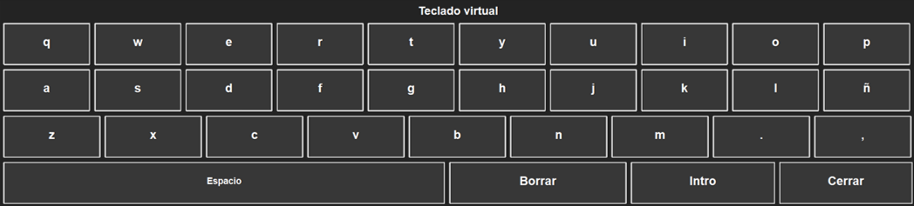

# Interfaz de control por visión artificial mediante movimientos de cabeza y gestos faciales para personas con movilidad reducida

Interfaz de control de ordenador basada en visión artificial, desarrollada como prototipo académico para explorar una alternativa de interacción accesible mediante webcam convencional, movimientos de cabeza y gestos faciales.

El sistema permite mover el cursor, realizar clics por permanencia, abrir una barra de comandos, ejecutar acciones de ratón, activar desplazamiento, usar un teclado virtual y pausar la interacción sin depender de hardware especializado colocado sobre el usuario.

> Proyecto desarrollado como Trabajo de Fin de Grado en Ingeniería Informática. No debe interpretarse como un producto asistivo certificado ni como sustituto directo de soluciones comerciales especializadas.

## Índice

- [Características principales](#características-principales)
- [Funcionamiento general](#funcionamiento-general)
- [Capturas del prototipo](#capturas-del-prototipo)
- [Estructura del proyecto](#estructura-del-proyecto)
- [Arquitectura interna](#arquitectura-interna)
- [Requisitos](#requisitos)
- [Instalación desde código fuente](#instalación-desde-código-fuente)
- [Ejecución](#ejecución)
- [Uso básico](#uso-básico)
- [Configuración de usuario](#configuración-de-usuario)
- [Privacidad y tratamiento de datos](#privacidad-y-tratamiento-de-datos)
- [Scripts de evaluación](#scripts-de-evaluación)
- [Limitaciones actuales](#limitaciones-actuales)

## Características principales

- Control del cursor mediante orientación de cabeza, calculada a partir de la señal facial detectada por webcam.
- Calibración inicial basada en una posición neutra de la cabeza.
- Clic izquierdo mediante permanencia del cursor sobre una zona estable.
- Barra de comandos con selección por permanencia.
- Acciones disponibles: clic derecho, doble clic, desplazamiento, arrastrar y soltar, teclado virtual, ayuda, cancelar y salir.
- Teclado virtual en pantalla con selección por permanencia.
- Gestos faciales configurables para pausar/reanudar y abrir el menú de comandos.
- Suavizado adaptativo, zonas muertas, curva de respuesta no lineal y asistencia de precisión para reducir saltos del cursor.
- Separación entre lógica de visión, procesamiento, interacción, acciones del sistema operativo e interfaz visual.
- Configuración persistente por usuario.
- Procesamiento local en tiempo real, sin almacenamiento de imágenes ni vídeo de la cámara en el flujo normal de uso.

## Funcionamiento general

El prototipo sigue un ciclo continuo de captura, detección, procesamiento e interacción:

1. Se obtiene un fotograma de la webcam.
2. Se detecta el rostro y se extraen datos faciales relevantes.
3. Se calcula la orientación de la cabeza respecto a la posición calibrada.
4. La señal se transforma en coordenadas de cursor.
5. Se aplican filtros de suavizado y asistencia de precisión.
6. El motor de interacción interpreta el estado actual del sistema.
7. Se actualizan overlays visuales, barra de comandos o teclado virtual si procede.
8. Las acciones finales se delegan en una capa de plataforma, principalmente Windows en la versión actual.

La misma señal facial puede tener significados distintos según el estado activo del sistema. Por ejemplo, en navegación normal mueve el cursor, en modo scroll genera desplazamiento y en modo comandos permite seleccionar una opción de la barra.

## Capturas del prototipo

### Ventana de calibración inicial



### Barra de comandos



### Teclado virtual



## Estructura del proyecto

La estructura principal del código fuente se organiza dentro del paquete `src/`:

```text
src/
├─ main.py                         Punto de entrada de la aplicación
├─ app.py                          Orquestación general del prototipo
├─ app_logging.py                  Configuración de logs rotativos
├─ app_paths.py                    Rutas de configuración y logs por plataforma
├─ i18n.py                         Textos de interfaz en español e inglés
├─ actions/
│  └─ action_api.py                API común para acciones de ratón
├─ config/
│  ├─ settings.py                  Parámetros por defecto
│  └─ user_config.py               Carga y persistencia de configuración de usuario
├─ interaction/
│  ├─ states.py                    Estados principales del sistema
│  ├─ events.py                    Eventos internos de interacción
│  ├─ engine.py                    Máquina de estados
│  ├─ dwell.py                     Selección por permanencia
│  ├─ gesture_controller.py        Temporización y enfriamiento de gestos
│  └─ command_menu.py              Geometría y opciones de la barra de comandos
├─ platforms/
│  ├─ base.py                      Implementación genérica
│  ├─ windows.py                   Implementación específica para Windows
│  ├─ mac.py                       Esqueleto/adaptación para macOS
│  ├─ linux.py                     Esqueleto/adaptación para Linux
│  ├─ factory.py                   Selección de plataforma
│  └─ screen.py                    Métricas de pantalla y posición de cursor
├─ processing/
│  ├─ calibration.py               Referencia neutra de yaw y pitch
│  ├─ cursor.py                    Conversión de orientación facial a cursor
│  ├─ smoothing.py                 Suavizado adaptativo
│  ├─ precision.py                 Asistencia de precisión
│  └─ gestures.py                  Interpretación de blendshapes como gestos
├─ ui/
│  ├─ calibration_window.py        Ventana de calibración
│  ├─ settings_window.py           Ventana de ajustes
│  ├─ command_overlay.py           Gestor de overlay de comandos
│  ├─ qt_command_bar_overlay.py    Barra de comandos Qt
│  ├─ keyboard_overlay_manager.py  Gestor de teclado virtual
│  └─ qt_keyboard_overlay.py       Teclado virtual Qt
└─ vision/
   ├─ camera.py                    Captura de cámara y zoom digital
   └─ face_tracker.py              Detección facial con MediaPipe Face Landmarker
```

Los archivos `evaluar_*.py` incluidos en `src/` corresponden a pruebas técnicas y scripts de evaluación utilizados durante el desarrollo.

## Arquitectura interna

El sistema está organizado por capas para separar responsabilidades:

| Capa | Módulos principales | Responsabilidad |
| --- | --- | --- |
| Visión | `vision/` | Captura de cámara y extracción de información facial. |
| Procesamiento | `processing/` | Calibración, conversión a cursor, suavizado, precisión y gestos. |
| Interacción | `interaction/` | Estados, eventos, dwell y comandos. |
| Acciones | `actions/` | API común para ejecutar acciones de ratón. |
| Plataforma | `platforms/` | Implementaciones dependientes del sistema operativo. |
| Interfaz | `ui/` | Calibración, ajustes, barra de comandos y teclado virtual. |
| Configuración | `config/` | Parámetros por defecto y configuración persistente. |

Esta separación permite modificar la interfaz sin alterar el procesamiento del cursor, cambiar la implementación de plataforma sin reescribir el motor de interacción y evaluar componentes de forma independiente.

## Requisitos

### Hardware

- Ordenador con webcam funcional.
- Pantalla principal accesible desde el sistema operativo.
- Condiciones mínimas de iluminación para que el rostro sea detectable.

### Software

- Python ≥ 3.13.
- Windows como plataforma principal de ejecución.
- Linux y macOS cuentan con estructura de plataforma, pero no son el objetivo principal de la versión actual.

Además, se utiliza `tkinter` en algunos scripts de evaluación. En Windows suele estar incluido con la instalación estándar de Python.

## Instalación desde código fuente

Clonar el repositorio y entrar en la carpeta del proyecto:

```bash
git clone https://github.com/Sg2lk/TFG_Accessibility
cd TFG_Accessibility
```

Crear y activar un entorno virtual:

```bash
python -m venv .venv
```

En Windows:

```bash
.venv\Scripts\activate
```

Instalar dependencias:

```bash
pip install --upgrade pip
pip install -r requirements.txt
```

### Modelo de MediaPipe

El código espera encontrar el modelo de Face Landmarker en la siguiente ruta:

```text
models/face_landmarker.task
```

La estructura mínima esperada para ejecutar el proyecto desde código fuente es:

```text
.
├─ models/
│  └─ face_landmarker.task
└─ src/
   └─ main.py
```

Si el modelo no está disponible en esa ubicación, `FaceTracker` no podrá inicializarse correctamente.

## Ejecución

Desde la raíz del proyecto:

```bash
python -m src.main
```

Al iniciar, la aplicación abre la cámara, carga el detector facial, crea los overlays de Qt y muestra la ventana de calibración.

## Uso básico

1. Colocar el rostro dentro de la guía de calibración.
2. Mantener una postura cómoda y neutra.
3. Situar el puntero sobre la referencia indicada en la ventana de calibración.
4. Pulsar `Calibrar`.
5. Tras la calibración, usar el gesto de pausa/reanudación para activar el control.
6. Mover la cabeza para desplazar el cursor.
7. Mantener el cursor estable sobre una zona para hacer clic izquierdo por permanencia.
8. Usar el gesto de comandos para abrir la barra de comandos.
9. Seleccionar una opción de la barra manteniendo el cursor sobre ella.

### Gestos por defecto

| Función | Gesto por defecto | Tiempo aproximado |
| --- | --- | --- |
| Pausar o reanudar | Boca abierta | 1,2 s |
| Abrir menú de comandos | Sonrisa | 0,25 s |
| Clic izquierdo | Permanencia del cursor | 1,2 s |

Estos valores pueden modificarse desde la configuración de usuario.

### Barra de comandos

La barra de comandos incluye las siguientes opciones:

| Opción | Acción |
| --- | --- |
| Derecho | Ejecuta clic derecho sobre el objetivo bloqueado. |
| Doble | Ejecuta doble clic sobre el objetivo bloqueado. |
| Scroll | Activa el modo de desplazamiento vertical u horizontal. |
| Arrastrar | Mantiene pulsado el botón izquierdo hasta liberarlo por permanencia. |
| Teclado | Abre el teclado virtual. |
| Ayuda | Muestra una guía rápida de uso. |
| Salir | Cierra la aplicación de forma segura. |
| Cancelar | Cierra la barra de comandos sin ejecutar acción. |

Al abrir la barra, el sistema fija un objetivo en la última posición estable del cursor. Esto permite que acciones como clic derecho, doble clic o arrastre se ejecuten sobre el punto previsto, aunque el gesto facial utilizado para abrir el menú introduzca pequeños movimientos involuntarios.

## Configuración de usuario

La aplicación dispone de parámetros por defecto en `src/config/settings.py` y de una configuración persistente gestionada por `src/config/user_config.py`.

Parámetros configurables destacados:

- Idioma de interfaz.
- Zoom digital de cámara.
- Sensibilidad horizontal y vertical.
- Tiempo de permanencia para clic.
- Gesto de pausa/reanudación.
- Gesto de apertura del menú de comandos.
- Tiempo de mantenimiento de gestos.
- Umbrales de guiño, boca abierta, sonrisa y cejas levantadas.

En Windows, la configuración se guarda en:

```text
%LOCALAPPDATA%\TFGAccessibility\user_config.json
```

Los logs se guardan en:

```text
%LOCALAPPDATA%\TFGAccessibility\logs\app.log
```

En otros sistemas, la implementación genérica utiliza una carpeta de usuario equivalente:

```text
~/.TFGAccessibility/
```

## Privacidad y tratamiento de datos

El sistema procesa la imagen de la webcam en local y en tiempo real. En el flujo normal de uso no guarda fotogramas, vídeos, imágenes del rostro ni landmarks faciales como archivos de usuario.

La calibración registra únicamente una referencia neutra de orientación, basada en los valores de `yaw` y `pitch` considerados como centro. La configuración persistida se limita a parámetros operativos como sensibilidad, idioma, tiempos y umbrales.

Los logs almacenan información técnica de ejecución, estados, errores y trazas de depuración, pero no contenido visual.

## Scripts de evaluación

El repositorio incluye varios scripts utilizados para comprobar aspectos concretos del prototipo:

| Script | Propósito |
| --- | --- |
| `src/evaluar_metricas_cursor.py` | Evalúa estabilidad y desplazamientos del cursor en distintas fases de procesamiento. |
| `src/evaluar_precision_puntos_simple.py` | Mide error respecto a puntos objetivo en pantalla. |
| `src/evaluar_rendimiento_f10_aplicacion.py` | Evalúa rendimiento general de la aplicación, tiempos de ciclo, detección facial y FPS. |
| `src/evaluar_teclado_virtual_app.py` | Evalúa escritura mediante el teclado virtual en una ventana externa. |

Ejemplo de ejecución:

```bash
python -m src.evaluar_metricas_cursor
python -m src.evaluar_precision_puntos_simple
python -m src.evaluar_rendimiento_f10_aplicacion
python -m src.evaluar_teclado_virtual_app
```

Estas pruebas requieren cámara funcional y, en algunos casos, interacción manual durante la calibración o durante la escritura.

## Limitaciones actuales

- El sistema es un prototipo académico y no una solución asistiva certificada.
- La plataforma principal es Windows. Linux y macOS disponen de una estructura de adaptación, pero requieren validación adicional.
- El rendimiento depende de la calidad de la cámara, iluminación, encuadre, reflejos, gafas y estabilidad postural.
- El control por cabeza y gestos es más estable para este prototipo que el seguimiento ocular puro con webcam estándar, pero sigue requiriendo calibración y ajuste individual.
- No se almacenan perfiles biométricos ni plantillas faciales, por lo que la personalización se limita a parámetros operativos.
- La aplicación puede requerir permisos o ajustes adicionales según el sistema operativo y las políticas de seguridad del entorno.
- El modelo `face_landmarker.task` debe estar disponible para poder ejecutar la detección facial.

## Autor

Proyecto desarrollado por Johan Alexander Pulupa Romero como Trabajo de Fin de Grado en Ingeniería Informática.
